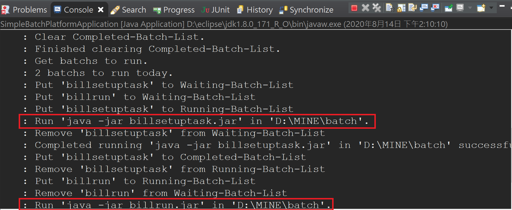
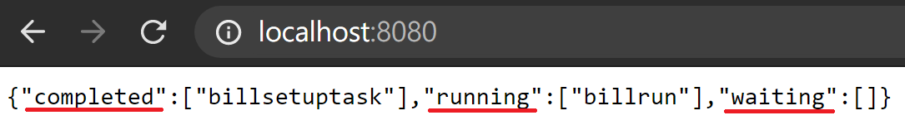
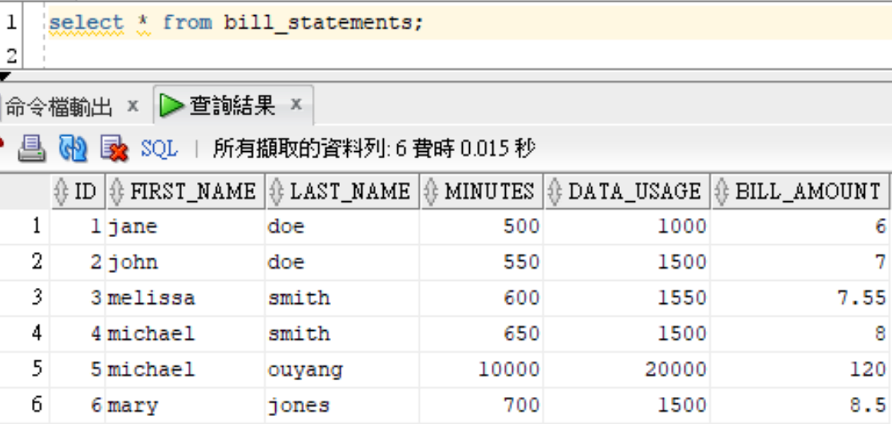

# Simple-Batch-Platform

## Purpose
#### This is a batch-platform that can execute jar files in specific time and dependency order.

---

## Usage
**1. First, create java archives.**
- creating two tasks (billsetuptask and billrun) from spring offcial document https://spring.io/guides/gs/spring-cloud-task in this project.

---

**2. Second, insert batches' information like jar_name, execute_time, dependency into database base on there execution frequency. (daily basis, monthly basis, yearly basis)**

- In below case, both tasks are set to execute at 9AM everyday, but billrun will only execute after billsetuptask complete running.

> INSERT INTO DAILY_BATCH(JAR_NAME, NOTE, HOUR, MINUTE, WAITING_JAR) VALUES('billsetuptask', 'create table BILL_STATEMENTS', '09', '00', null);

> INSERT INTO DAILY_BATCH(JAR_NAME, NOTE, HOUR, MINUTE, WAITING_JAR) VALUES('billrun', 'insert data to table BILL_STATEMENTS', '09', '00', 'billsetuptask');

---

**3. Third, put those java archives in the directory where you set to parameter (batch.directory) in application.properties.**

- Put billsetuptask.jar and billrun.jar into D:/MINE/batch and add below configuration.

> batch.directory=D:/MINE/batch

---

**4. Last, run the application and observe the running status through console log or online api.**
- console log

- online api

---

**5. Result table after billsetuptask and billrun completed.**

